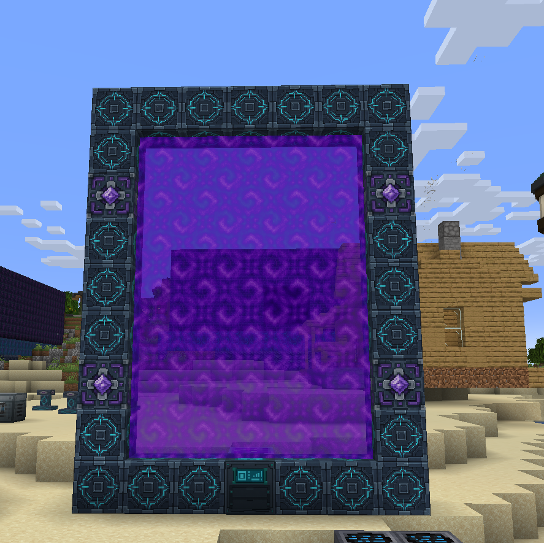
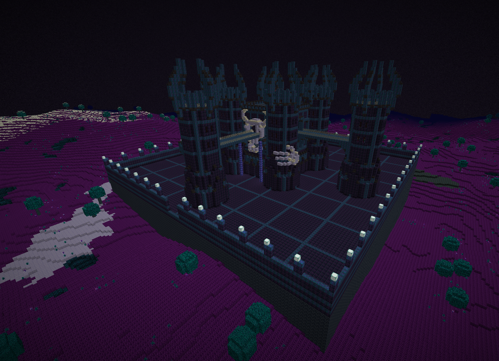
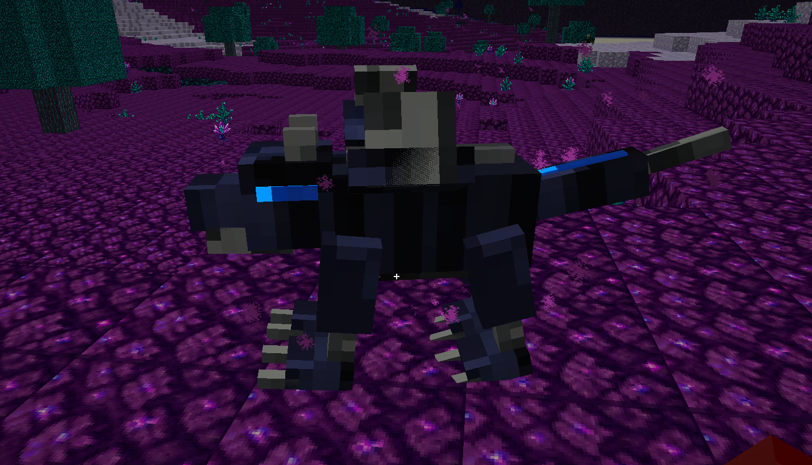
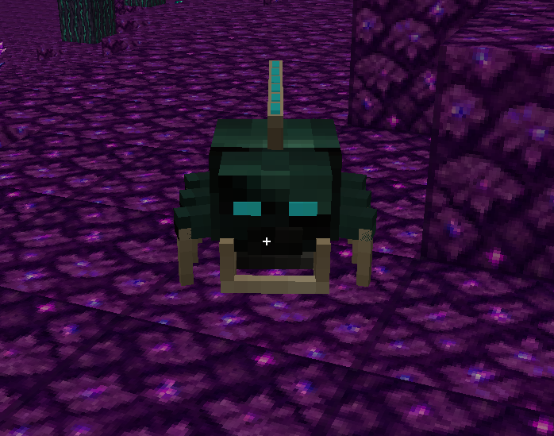
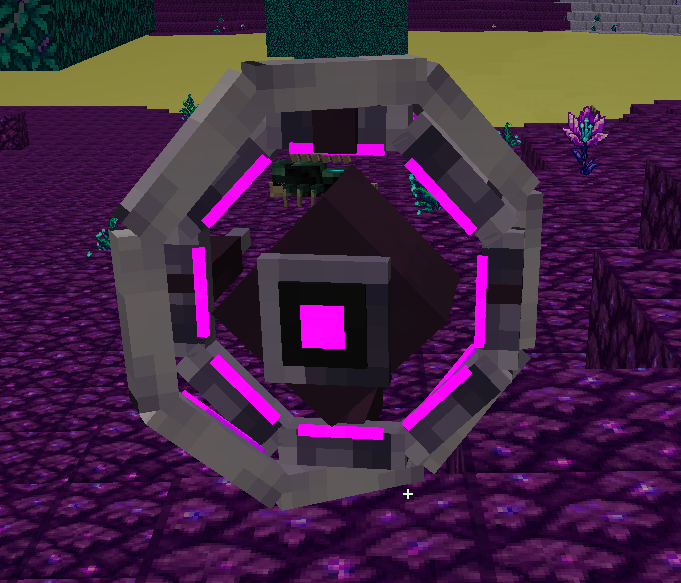
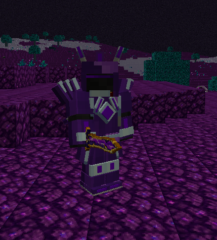
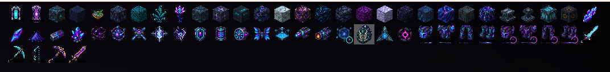

# Quantum Rift

**Minecraft 1.20.4 · Fabric · Эндгейм после Tech Reborn**

Квантовая броня собрана, завод работает. Что дальше?

Quantum Rift продолжает развитие Tech Reborn и Gobber 2. Постройте цифровой портал и отправляйтесь в **Нулевую сеть** — новое измерение со своими ресурсами, заброшенными сооружениями и обитателями, которым есть что противопоставить вашей экипировке.

В моде есть:

- Новое измерение с пещерами, необычной растительностью и водоёмами из жидкостей Tech Reborn.
- Подземелья, опасные мобы и боссы.
- Два новых уровня брони с энергетическими щитами, полётом и улучшениями.
- Энергетическое оружие и мультитулы для масштабной добычи.
- Собственные машины, накопители энергии и карманные аккумуляторы.
- Сеть порталов между измерениями и достижения, включая скрытые.

Это следующий этап игры, а не замена уже построенному производству. Квантовая экипировка и вещи Gobber пригодятся для дальнейшего развития.

Остальное интереснее найти самому. А если понадобится подсказка — скрафтите руководство: внутри есть рецепты, схемы и объяснения механик.

## Скриншоты

  

  
  
  

  

## Требования

Текущий выпуск — **1.0.1**, для **Minecraft Java Edition 1.20.4**, загрузчик **Fabric**, Java **17+**. Для Forge и NeoForge сборок нет.

Проверенная связка зависимостей:

| Компонент | Версия |
| --- | --- |
| Fabric Loader | 0.15.11 |
| Fabric API | 0.97.2+1.20.4 |
| Tech Reborn | 5.10.3 |
| Reborn Core | 5.10.3 |
| Gobber 2 | 2.9.9 |
| Cloth Config API — нужен Gobber 2 | 13.0.121 |

Все файлы выбирайте для **Fabric 1.20.4**. Energy API включён в Quantum Rift, Pugh Tools — в указанный выпуск Gobber 2.

**Необязательно:** REI для просмотра рецептов (проверена версия 14.1.727, устанавливается со своими зависимостями).

## Установка

Поместите JAR из **Releases** в папку `mods` вместе с обязательными зависимостями. На сервере и у игроков должна стоять одинаковая версия Quantum Rift. При обновлении заменяйте старый JAR и делайте резервную копию мира.
